<picture>
  <source media="(prefers-color-scheme: dark)" srcset="./dark.svg">
  <source media="(prefers-color-scheme: light)" srcset="./light.svg">
  
</picture>

## Hi, I'm Gaurav

AI/ML software engineer who builds backend systems and AI-powered applications. I work mostly in Python and TypeScript, wire LLMs into real products, and spend a lot of time on testing, debugging and keeping production software reliable.

Currently a Research Software Engineer at Binghamton University. Based in San Ramon, CA.

## Focus

- **Backend systems:** REST APIs, data pipelines and services in Python, Node.js and SQL
- **LLM applications:** Claude API integrations, AI agents, RAG
- **Reliability:** root-cause analysis, logging, automated testing and CI/CD

## Experience

**Research Software Engineer, Binghamton University** (Feb 2026 – Present)
- Build backend services and software modules in Python and TypeScript using object-oriented design
- Resolved 20+ production issues through systematic debugging and root-cause analysis
- Take part in architecture discussions and code reviews

**Full-Stack Engineer, Elite Softwares, Pune** (Aug 2021 – Apr 2023)
- Built and optimized RESTful APIs and backend services with Python, Node.js and SQL
- Tuned PostgreSQL and SQLite queries for data-heavy and reporting workloads
- Added logging and debugging workflows that cut issue resolution time by 50%

## Featured projects

| Project | What it is |
| --- | --- |
| **Aegis** | Autonomous incident response copilot (Next.js frontend, eval harness, CI/deployment config) |
| **Lull** | AI voice companion desktop app (Tauri/React, Deepgram STT, ElevenLabs TTS, Claude, pgvector memory) |
| **SpendGuard** | Invoice compliance agent (tool-calling orchestrator, Redis/RQ background jobs, Next.js review queue) |
| **AI Voice Bot** | GenAI voice assistant on Python, Flask, Twilio and the Claude API |
| **ContentPlus** | Python data pipeline serving RESTful APIs, with PostgreSQL, automated tests and GitHub Actions |

## Engineering stack

| | |
| --- | --- |
| **Languages** | Python, TypeScript, JavaScript, Java, C++, SQL |
| **Backend** | FastAPI, Flask, Node.js, Express.js, Spring Boot, REST APIs, Microservices |
| **Frontend** | React, Tailwind CSS, HTML, CSS |
| **AI / ML** | Claude API, LLM APIs, AI agents, RAG, LangChain, PyTorch, TensorFlow, scikit-learn, NLP |
| **Data** | PostgreSQL, MySQL, SQLite, Redis |
| **DevOps** | Docker, Kubernetes, GitHub Actions, CI/CD, Linux |

## Education

- M.S. Computer Science, SUNY Binghamton (2023 – 2025)
- B.E. Computer Engineering, Savitribai Phule Pune University (2019 – 2023)

## GitHub activity

<picture>
  <source media="(prefers-color-scheme: dark)" srcset="https://github-readme-stats.vercel.app/api?username=gdurgude&show_icons=true&theme=transparent&hide_border=true&title_color=22D3EE&icon_color=A78BFA&text_color=F8FAFC">
  <source media="(prefers-color-scheme: light)" srcset="https://github-readme-stats.vercel.app/api?username=gdurgude&show_icons=true&theme=transparent&hide_border=true&title_color=2563EB&icon_color=6D28D9&text_color=0F172A">
  
</picture>

## Connect

- GitHub: [github.com/gdurgude](https://github.com/gdurgude)
- LinkedIn: [linkedin.com/in/gauravdurgude](https://www.linkedin.com/in/gauravdurgude)
- Email: [gauravdurgude9@gmail.com](mailto:gauravdurgude9@gmail.com)
