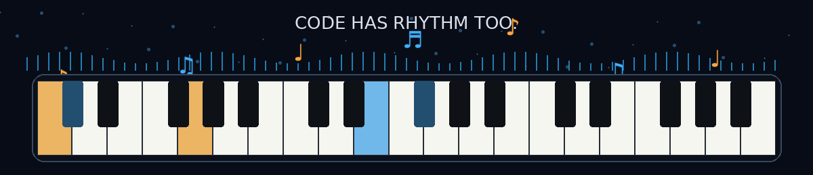

<div align="center">


<br/>

# Hey, I'm Gaurav 👋

### AI Engineer · Full-Stack Builder · Pianist 🎹

**I build systems by day and play them by ear at night.**

</div>

---

## 🎼 Currently Composing

```text
AI Agents        █████████░  building
Voice AI         ████████░░  experimenting
Backend Systems  █████████░  shipping
Piano            ██████████  always
```

I like working where **software engineering, AI and real-world reliability** meet — building systems that are useful, testable, fast, and understandable when something goes wrong.

<div align="center">


</div>

---

## 🎧 Featured Tracks

| Track | Project | What it does | Built with |
|---|---|---|---|
| `01` | **Lull** | Mood-aware AI voice agent with speech, memory and proactive conversation flows | FastAPI · Deepgram · ElevenLabs · Claude · PostgreSQL |
| `02` | **ContentPlus** | AI classification and data pipeline with optimized backend workflows | Python · PostgreSQL · REST APIs · GitHub Actions |
| `03` | **ShipGuard** | Multi-agent shipping risk monitor for analyzing operational risk | Python · AI Agents · APIs · Docker |
| `04` | **AI Voice Bot** | Real-time phone agent built around resilient, independent conversation steps | Python · Flask · Twilio · Claude |

> I care less about demos that only work once and more about what happens when the API times out, the model returns something unexpected, or the system meets real users.

---

## 🛠️ My Instruments

**Languages**  
`Python` · `TypeScript` · `JavaScript` · `SQL` · `Java`

**Frontend**  
`React` · `Next.js` · `HTML` · `CSS` · `Tailwind CSS`

**Backend & Data**  
`FastAPI` · `Flask` · `Django` · `Node.js` · `REST APIs` · `PostgreSQL` · `Redis`

**AI**  
`Claude` · `OpenAI API` · `AI Agents` · `RAG` · `LangChain` · `LLM Evaluation`

**Engineering**  
`Docker` · `GitHub Actions` · `CI/CD` · `Linux` · `Testing` · `System Design`

---

## 🎹 Live Motion

<div align="center">



**Code. Create. Compose. Repeat.**

</div>

---

## 🧠 How I Build

```text
01  Understand the problem before touching the stack
02  Build the smallest useful version
03  Use AI to move faster — never as an excuse to stop thinking
04  Test the ugly failure paths, not only the happy path
05  Measure, simplify, ship
```

---

## 🔊 What I Like Working On

- AI agents that actually **do useful work**
- Real-time voice and conversational systems
- Full-stack products with strong backend architecture
- APIs, databases and performance debugging
- Developer tooling and automation
- Systems where reliability matters as much as the demo
- Anything that lets me combine **engineering + creativity**

---

## 🎵 The Other Side of Me

I've been playing piano for years, and it changes the way I think about engineering.

Music teaches you to recognize patterns, hear when something is off, improvise when the expected path breaks, and keep timing across many moving parts.

Software isn't that different.

> **Same patterns. Different instruments.**

---

## 🤝 Let's Connect

<div align="center">

**Open to conversations about AI, software engineering, startups, music, and building interesting things.**

[LinkedIn](https://www.linkedin.com/in/gauravdurgude/) · [Email](mailto:gauravdurgude9@gmail.com)

<br/>

### ♪ Better systems. Brighter ideas. And a little more music in between. ♪

</div>
