<div align="center">

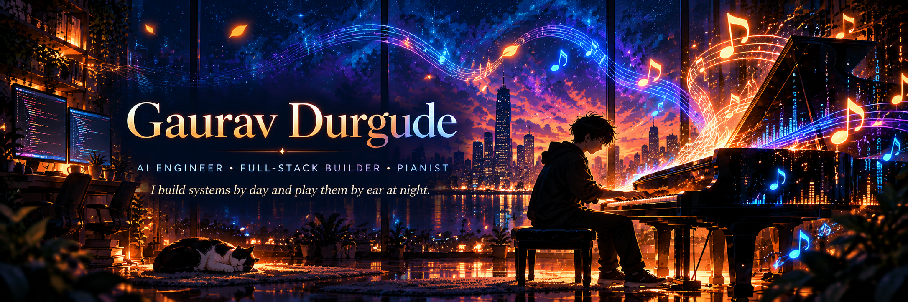

<br/>

# Gaurav Durgude

### AI Engineer · Full-Stack Builder · Pianist 🎹

**I build intelligent systems, ship full-stack products, and play piano by ear.**

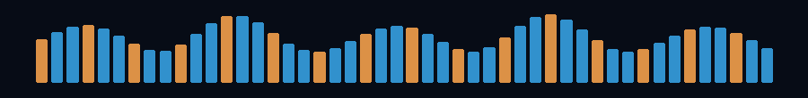

</div>

---

## 🎼 Currently Composing

<table>
<tr>
<td width="50%"><b>🤖 AI + Agents</b><br><br>Building AI systems that can reason, use tools, and survive real-world failure modes.</td>
<td width="50%"><b>🎙️ Voice AI</b><br><br>Real-time conversational systems where latency, reliability and flow actually matter.</td>
</tr>
<tr>
<td width="50%"><b>⚙️ Backend Systems</b><br><br>APIs, data flows, production debugging, performance and the unglamorous things that make software reliable.</td>
<td width="50%"><b>🎹 Piano</b><br><br>Pattern recognition, improvisation, and refusing to leave a wrong note unresolved.</td>
</tr>
</table>

---

# 🎧 Featured Tracks

> Projects I’d actually want someone to open, break, question, and discuss with me.

<p align="center">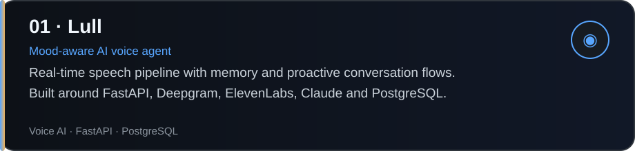</p>
<p align="center">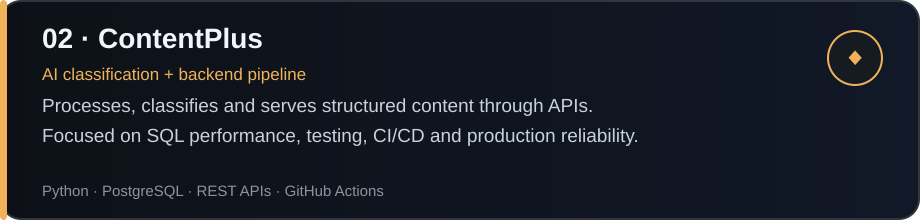</p>
<p align="center">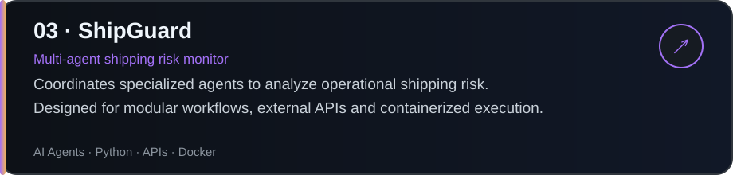</p>
<p align="center">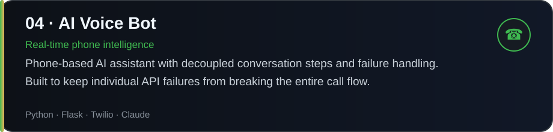</p>

---

# 🧭 Experience

<p align="center">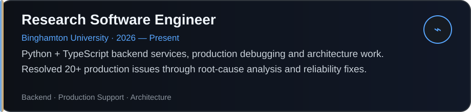</p>
<p align="center">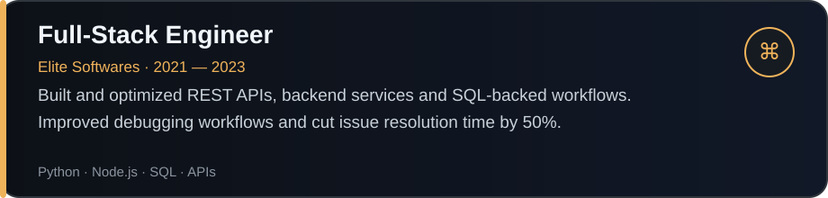</p>
<p align="center">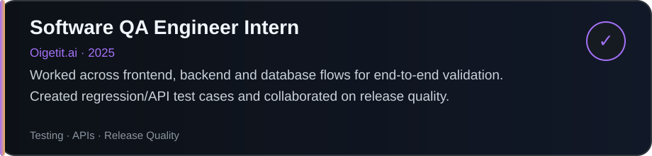</p>

---

# 🛠️ My Instruments

<table>
<tr><td><b>Languages</b></td><td>Python · TypeScript · JavaScript · Java · SQL</td></tr>
<tr><td><b>Frontend</b></td><td>React · Next.js · HTML · CSS · Tailwind CSS</td></tr>
<tr><td><b>Backend</b></td><td>FastAPI · Flask · Django · Node.js · REST APIs · Microservices</td></tr>
<tr><td><b>Data</b></td><td>PostgreSQL · Redis · MySQL · SQLite · pgvector</td></tr>
<tr><td><b>AI</b></td><td>Claude · OpenAI API · AI Agents · RAG · LangChain · LlamaIndex · LangGraph</td></tr>
<tr><td><b>Engineering</b></td><td>Docker · GitHub Actions · CI/CD · Linux · Testing · System Design · Production Debugging</td></tr>
</table>

---

# 🎹 Live Motion

<div align="center">


### `CODE HAS RHYTHM TOO.`

</div>

---

# 🧠 How I Build

```text
01  Understand the system before choosing the stack
02  Build the smallest useful version
03  Use AI to move faster — not to stop thinking
04  Debug from evidence, not guesses
05  Test the ugly failure paths
06  Measure what matters
07  Simplify
08  Ship
```

I’m especially interested in systems where **AI meets production reality**: voice, agents, backend reliability, developer tooling, automation, and performance.

---

# 🎵 Same Patterns. Different Instruments.

Piano changed the way I think about engineering.

You learn to hear when one note is wrong even when everything around it sounds fine.  
You learn patterns before you learn speed.  
You improvise when the expected path breaks.  
You keep rhythm across many moving parts.

That is surprisingly close to debugging software.

> **Music taught me to listen. Engineering taught me where to look.**

---

# 🤝 Let’s Connect

<table>
<tr>
<td width="50%"><a href="https://www.linkedin.com/in/gauravdurgude/"></a></td>
<td width="50%"><a href="mailto:gauravdurgude9@gmail.com">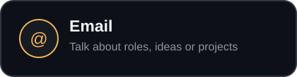</a></td>
</tr>
<tr>
<td width="50%"><a href="https://github.com/"></a></td>
<td width="50%">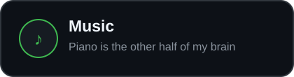</td>
</tr>
</table>

<div align="center">

### Open to conversations about AI, software engineering, startups, voice systems, and music.

**Bay Area, California**

<br/>

### ♪ Better systems. Better ideas. A little more music in between. ♪

</div>
